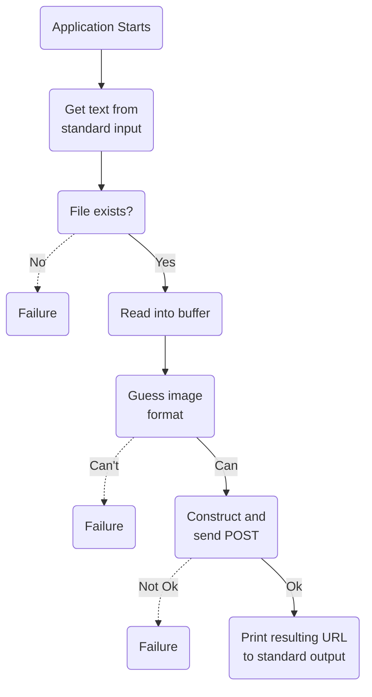

# foobar2000-catbox

## Description
Uploads cover art to https://catbox.moe/ using their API and prints the resulting link to the uploaded image.
This application is meant to be invoked by [this fork of foo_discord_rich by s0hv](https://github.com/s0hv/foo_discord_rich).

## Application flow
Here's a small flowchart describing the flow of the application.

## TODO
- [x] make a really cool flowchart
- [ ] guide to installation and usage
- [ ] automatic compression/downscaling
