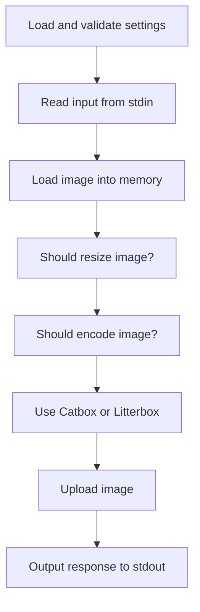

# foobar2000-catbox

[](https://www.rust-lang.org/)
[](https://github.com/realoksi/foobar2000-catbox/releases/latest)
[](https://github.com/realoksi/foobar2000-catbox/actions/workflows/rust.yml)
[](https://codecov.io/gh/realoksi/foobar2000-catbox)

## About

This is a helper application that uploads images to Catbox/Litterbox, and is meant to be invoked by the [foo_discord_rich](https://github.com/TheQwertiest/foo_discord_rich) plugin.

## Compiling

### Windows

Use [rustup](https://www.rust-lang.org/tools/install) to download an appropriate toolchain for Windows.
Don't forget to install [git](https://git-scm.com/downloads/win) if you're cloning this repository.

- Clone the repository with git:

```sh
git clone https://github.com/realoksi/foobar2000-catbox.git
```

- `cd` into the cloned directory:

```sh
cd foobar2000-catbox
```

- Compile the application:

```sh
cargo build -r
```

> [!NOTE]
> `-r` compiles the application as a release build, which excludes unecessary debug information and performs important optimizations

So long as there are no errors while compiling, you'll end up with a build available at `target/release/foobar2000-catbox.exe`.

## Installation

You can download the latest release build of `foobar2000-catbox.exe` from the repository [releases](https://github.com/realoksi/foobar2000-catbox/releases) if you aren't compiling. Otherwise, use the compiled executable from the previous section. We're also assuming you have [foo_discord_rich](https://github.com/theqwertiest/foo_discord_rich) already installed.

- Move executable somewhere permanent

```sh
mv foobar2000-catbox.exe C:\
```

> [!NOTE]
> Although the previous command moves it to the root of the C drive, you can put it anywhere as long as the path specified later in foobar2000 is accurate

- Open foobar2000

- Open the `Preferences` menu from the `File` dropdown in the toolbar

> [!TIP]
> You can also use the Ctrl+P shortcut

- On the left-side list under `Tools` click `Discord Rich Presence Integration`

- Navigate to the `Advanced` tab

- Check the box labeled: `Upload and display art (disables MusicBrainz fetcher)`

- Specify the executable path in the `Upload command` textbox.

> [!TIP]
> For example, if the executable is at the root of our C drive like demonstrated earlier, we'd use "C:\foobar2000-catbox.exe" as the `Upload command` value (quotes included)

## Usage

After installation, cover art will be uploaded automatically for each song/album that's played. *No further configuration from this point on is necessary to have a working instance.*

### Settings (optional)

As with the previous version of this uploader, you can fine-tune its behavior further, now through the use of a YAML file that accompanies the executable.

|Feature|Description|
|-|-|
|Litterbox| You can now specify whether or not to use Litterbox - a service under Catbox that only temporarily stores uploaded files. You can also specify the expiration time from a set of predefined values (1, 12, 24, or 72 hours). After this time, your uploaded cover art will be removed from their database.|
|Encoding format and quality|Adjust encoding format and quality to get your desired speed/image fidelity. Currently, you can upload cover art as a JPG, PNG, or WEBP - as these are the formats supported by Discord. You may only currently control the quality level of JPGs.|
|Downscaling|Automatically downscale images that exceed a specified threshold.|

> [!WARNING]
> The WEBP encoder used at this time is **lossless only**. Using this **will** increase the file size of the uploaded image - slowing down both the upload and download speed of your cover art.

You can get started by copying the full sample `settings.yml` included in this repository to the same directory as your configured `foobar2000-catbox.exe` application. Descriptions are available in the sample file, along with acceptable values.

## Troubleshooting

TODO

## Diagram

Here's a small flowchart; A non-precise visualization outlining the flow of the application.



## Notes

- Litterbox is enabled by default to help reduce the potential impact on Catbox's services.
-

## TODO

- [ ] Add resize filter-type setting option
- [ ] Also use environment variables as configuration options
- [x] Write a mermaid chart outlining the process flow
- [x] Create basic compiling, installation, and usage instructions
- [ ] More comprehensive testing
- [ ] Github actions for version releases
- [ ] Reduce release version file size and compile time
- [ ] Write a troubleshooting section
