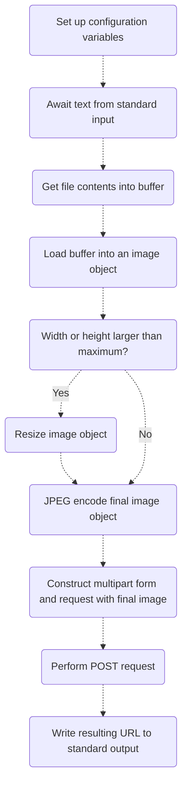

## 📰 Quick description

A helper application to be used with [foo_discord_rich](https://github.com/TheQwertiest/foo_discord_rich) for uploading album artwork to [catbox.moe](https://catbox.moe/).

## 🚨 Attention

Previous development was targeted towards a [fork of foo_discord_rich](https://github.com/s0hv/foo_discord_rich). No longer will this be the case, as future development will instead target the [original repository](https://github.com/TheQwertiest/foo_discord_rich) only.

## 📝 Settings file [optional]

### TODO

## 📊 Application flow

Here's a small flowchart; A non-precise visualization outlining the flow of the application.

## 📋 TODO

- [x] make a really cool flowchart
- [x] automatic compression/downscaling
- [x] basic configuration file for quality preferences
- [x] installation instructions (linked to setup instructions)
- [ ] add small audio samples with embedded artwork