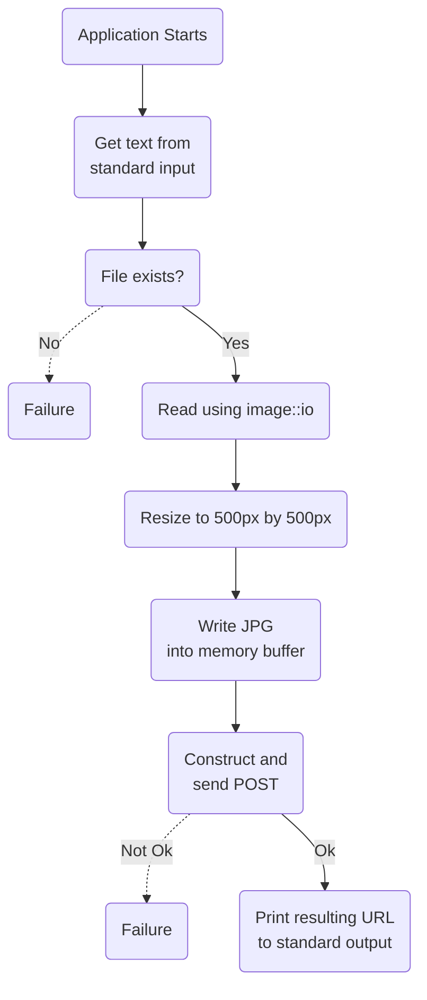

# foobar2000-catbox

## 📰 Short description

This application takes an image path as input, downscales and compressed the image in memory, then uploads it to [catbox.moe](https://catbox.moe/) using their API, and finally prints the resulting link to the uploaded image. It's not meant to be started manually, but rather be invoked by this fork of [foo_discord_rich](https://github.com/s0hv/foo_discord_rich) by [s0hv](https://github.com/s0hv) to upload cover art for music.

## 🔗 Links

- [Configuration file](#-configuration-file-optional)
- [Application flow](#-application-flow)
- [TODO](#-todo)

## 📝 Configuration file [Optional]

We're using a very primitive algorithm to parse key value pairs from a `config.txt` file to allow fine tuning of the output without having to recompile the application. It reads this file line by line, separating key value pairs using `=` as the delimiter. You don't need to include it at all, nor do you need to define every value. When a key isn't defined or is defined improperly, it will always fallback to the default value. Consider this when modifying these values, to be sure they are not malformed.

Here's a table showing all of the possible keys and their default values.
| Name | Default value | Description |
| - | - | - |
| MAX_WIDTH | 500 | A number, the width of the image will always be clamped to at most this width in pixels.|
| MAX_HEIGHT | 500 | A number, the height of the image will always be clamped to at most this height in pixels. |
| QUALITY | 80 | A number, the percentage of quality to retain. Higher looks better but has a larger file size and is slower, whereas lower looks worse but has a smaller file size and is faster. |
| USER_AGENT | Mozilla/5.0 (X11; Linux x86_64; rv:123.0) Gecko/20100101 Firefox/123.0 | A string, see [here](https://developer.mozilla.org/en-US/docs/Web/HTTP/Headers/User-Agent) for a description of this header. We need to send this with the POST request or else the default endpoint [catbox.moe](https://catbox.moe/) will kill the connection. This is out of our control, see issue #4. |
| ENDPOINT | <https://catbox.moe/user/api.php> | A string, the destination of our POST request. Since the form is designed to work with the format specified by the [tool API section on catbox](https://catbox.moe/tools.php), it's unlikely you'll be able to change this. |

Place or create a file named `config.txt` next to the `foobar2000-catbox.exe` executable. See the example [config.txt](config.txt) in this repository.

## 📊 Application flow (🚧Outdated🚧)

Here's a small flowchart, for visualizing the flow of the application.

## 📋 TODO

- [x] make a really cool flowchart
- [x] automatic compression/downscaling
- [x] basic configuration file for quality preferences
- [ ] installation instructions
