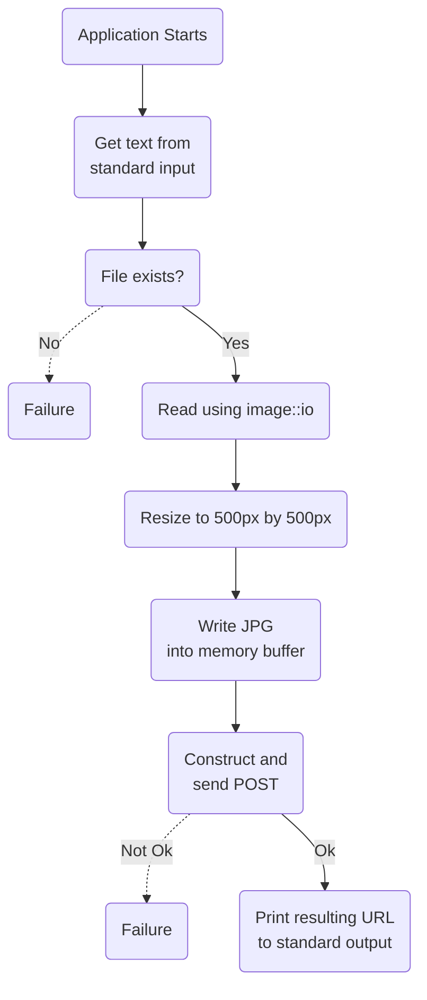

# foobar2000-catbox

## 📰 Description

Uploads cover art to <https://catbox.moe/> using their API and prints the resulting link to the uploaded image. Always downscales to 500x500px, and always compresses to JPG with 80% quality. This results in very fast uploads. This application is meant to be invoked by [this fork of foo_discord_rich by s0hv](https://github.com/s0hv/foo_discord_rich).

## 📝 Configuration file [Optional]

We're using a very primitive algorithm to parse key value pairs from a basic `config.txt` file to allow fine tuning of the output without having to recompile the application. It reads this file line by line, separating key value pairs using `=` as the delimiter. You don't need to include it at all, nor do you need to define every value. When a key isn't defined or is defined improperly, it will always fallback to the default value. Consider this when modifying these values, to be sure they are not malformed.

Here's a table showing all of the possible keys and their default values.
| Name | Default Value | Description |
| - | - | - |
| MAX_WIDTH | 500 | The width of the image will always be clamped to at most this size in pixels.|
| MAX_HEIGHT | 500 | The height of the image will always be clamped to at most this size in pixels. |
| QUALITY | 80 | A percentage of quality to retain. Higher looks better but is larger and slower, whereas lower looks worse but is faster. |
| USER_AGENT | Mozilla/5.0 (X11; Linux x86_64; rv:123.0) Gecko/20100101 Firefox/123.0 | See [here](https://developer.mozilla.org/en-US/docs/Web/HTTP/Headers/User-Agent) for a description of this header. We need to send this with the POST request or else the default endpoint [catbox.moe](https://catbox.moe/) will kill the connection. |
| ENDPOINT | <https://catbox.moe/user/api.php> | The endpoint is where we send the POST request. |

To use this file, create one with the keys and values you want to modify

## 📊 Application flow

Here's a small flowchart, for visualizing the flow of the application.

## 📋 TODO

- [x] make a really cool flowchart
- [x] automatic compression/downscaling
- [ ] basic configuration file for quality preferences
