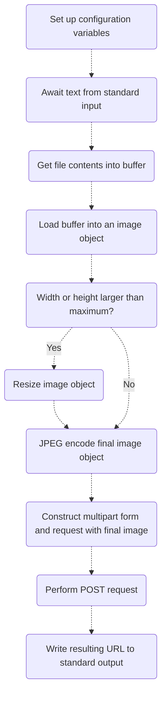

## 📰 Quick description

A helper application to be used with [foo_discord_rich](https://github.com/TheQwertiest/foo_discord_rich) for uploading album artwork to [catbox.moe](https://catbox.moe/).

## 🚨 Attention

Previous development was targeted towards a [fork of foo_discord_rich](https://github.com/s0hv/foo_discord_rich). No longer will this be the case, as future development will instead target the [original repository](https://github.com/TheQwertiest/foo_discord_rich) only.

## 📝 Configuration file [optional]

You may include a configuration file for tuning behavior. You don't need to include it at all for basic functionality, nor do you need to define every value. When a key isn't defined or is improper, it will always fallback to the default value.

Again, remember that this is optional. To use, create a file named `config.txt` next to the executable. Check out the example [config.txt](config.txt) in this repository as a base to start with.

See the table below showing all of the possible keys and their default values.
| Name | Default value | Description |
| - | - | - |
| MAX_WIDTH | 500 | A number, the width of the image will always be clamped to at most this width in pixels.|
| MAX_HEIGHT | 500 | A number, the height of the image will always be clamped to at most this height in pixels. |
| QUALITY | 80 | A number, the percentage of quality to retain. Higher looks better but has a larger file size and is slower, whereas lower looks worse but has a smaller file size and is faster. |
| USER_AGENT | Mozilla/5.0 (X11; Linux x86_64; rv:129.0) Gecko/20100101 Firefox/129.0 | A string, see [here](https://developer.mozilla.org/en-US/docs/Web/HTTP/Headers/User-Agent) for a description of this header. We need to send this with the POST request or else the default endpoint [catbox.moe](https://catbox.moe/) will kill the connection. See issue [#4](https://github.com/realoksi/foobar2000-catbox/issues/4). |
| ENDPOINT | <https://catbox.moe/user/api.php> | A string, the destination of our POST request. Since the form is designed to work with the format specified by the [tool API section on catbox](https://catbox.moe/tools.php), it's unlikely you'll be able to change this. |

## 📊 Application flow

Here's a small flowchart; A non-precise visualization outlining the flow of the application.

## 📋 TODO

- [x] make a really cool flowchart
- [x] automatic compression/downscaling
- [x] basic configuration file for quality preferences
- [x] installation instructions (linked to setup instructions)
- [ ] add small audio samples with embedded artwork